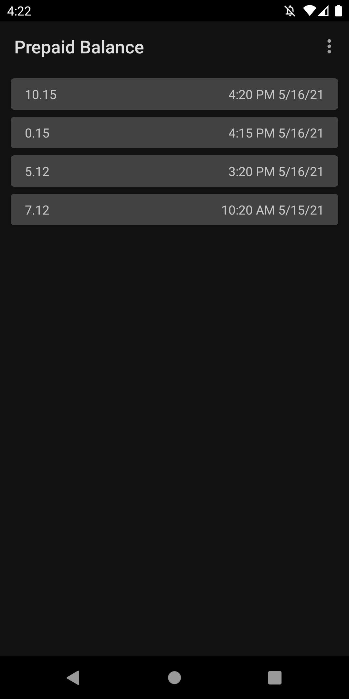

# Prepaid balance

This app keeps track of your prepaid balance. It can automatically record it and post a notification if your balance drops under a configurable threshold.
It does so by parsing the response of a USSD code, that can be set in the settings.

## Maintenance notice

From my point of view this app is feature complete. I probably won't add new major features on my own, but I will:
* Keep dependencies up-to-date
* Merge new translations
* Fix bugs
* Review and merge PRs, even for new features

## Translations

App strings and the app store description can be translated via Crowdin: https://crowdin.com/project/prepaidbalance

Translations have to be approved before being merged into the app. To become a translator with approval rights or to request a new language, please [poke me on Crowdin](https://crowdin.com/profile/mueller-ma) or open an issue here on GitHub. 

## Troubleshooting

You might run into on of these issues with the app:
* The USSD code is different than the default. In this case please configure the correct one and open an issue, so I can change the default code for your provider. 
* Your provider doesn't provide a USSD code to query your prepaid balance. In this case you cannot use this app.
* The USSD code to query the balance is "menu based", i.e. if you enter it in the dialer app, you get a menu. See [this issue](https://github.com/mueller-ma/PrepaidBalance/issues/81#issuecomment-1131516634) for more details.
* Depending on the response pattern the parsing might fail. In this case please open an issue.

## Development

### Fix parsing of an USSD code response

* Add a new `Matcher` to `MATCHERS` in `ReponseParser.kt`
* Add your USSD code to `testGetBalance()` in `ResponseParserTest.kt`
* Check if all test succeed

## Android permissions

* `CALL_PHONE`: Used to query USSD codes.
* `POST_NOTIFICATIONS`: Used to display notifications about your balance.
* `ACCESS_NETWORK_STATE`, `RECEIVE_BOOT_COMPLETED`, `FOREGROUND_SERVICE`, `WAKE_LOCK`: Used by [WorkManager](https://developer.android.com/reference/androidx/work/WorkManager) to ensure work constraints are met and running workers aren't killed.

## Credits

* Feature graphic by https://unsplash.com/@joshappel
